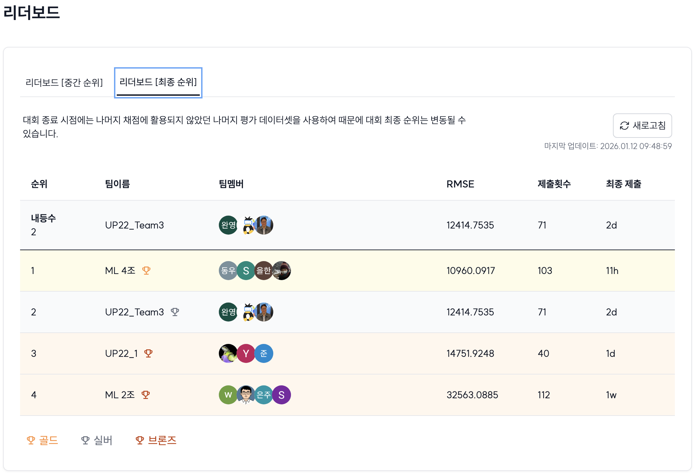

[](https://classroom.github.com/a/gmRFsg7-)
# House Price Prediction | 아파트 실거래가 예측
## UP22_Team3

|  |  |  |  |
| :--------------------------------------------------------------: | :--------------------------------------------------------------: | :--------------------------------------------------------------: | :--------------------------------------------------------------: |
|            [김성수](https://github.com/JackyKIMSungSu)             |            [오영완](https://github.com/UpstageAILab)             |            [이찬송](https://github.com/UpstageAILab)             |            [장석원](https://github.com/UpstageAILab)            |
|                            팀장, 담당 역할                             |                            담당 역할                             |                            담당 역할                             |                            담당 역할                             |

## 0. Overview
### Environment
- Ubuntu 20.04.6 LTS
- Python 3.10.13

### Requirements
- matplotlib==3.7.1
- numpy==1.23.5
- pandas==1.5.3
- scipy==1.11.3
- seaborn==0.12.2
- scikit-learn==1.2.2
- statsmodels==0.14.0
- tqdm==4.66.1

## 1. Competiton Info

### Overview

- _서울시 아파트 실거래가 매매 데이터를 기반으로 아파트 가격을 예측하는 대회_

### Timeline

- Start Date : 2026-01-06
- Final submission deadline : 2026-01-11

## 2. Components

### Directory

- 
```
├── code
│   ├── jupyter_notebooks
│   │   └── apt_regression_BestScore.ipynb
│   └── train.py
├── docs
│   ├── pdf
│   │   └── [패스트캠퍼스]-AI-부트캠프-22기_3조_HousePricePrediction-경진대회-발표.pptx
│   └── paper
└── input
    └── data
        ├── eval
        └── train
```

## 3. Data descrption

### Dataset overview

- test.csv : test 데이터셋
- addr_xy.csv : 결측치 셋표X, 좌표Y 보간을 위한 데이터셋
- bus_feature.csv : 버스 정류장 데이터셋
- subway_feature.csv : 지하철역 데이터셋
- train.csv : train 데이터셋

### EDA

- 이상치 처리
    - 층 : 음수 -> 양수로 변경
    - target의 IQR을 확인하여 lower_bound 구간만 삭제
- 결측치 처리
    - Base Code 기준 + 추가
    - 지오코더 OpenAPI를 활용하여 아파트 주소와 매핑하여 위도/경도 좌표 획득
- 지역 : 구, 동 분리
- 시간 : 
    - 계약년, 계약월 분리
    - 아파트나이 생성
- 신축, 노후여부 생성
- 재건축/리모델링 여부 생성
- 면적 : 소형/중형/중대형/대형 구분 평형 변수 생성
- 단지 : 브랜드아파트여부, 대단지여부, 주상복합여부 생성
- 층고변수 : 저층, 중층, 고층
- 역세권 : 반경500m 이내 지하철역 존재 여부
- 교통편의점수(반경500m 이내) : 지하철역 수 * 3 + 버스정류장 갯수 * 0.5
- 시차변수(가격) : 최근 3개월 이동평균, 구별 평균가격, 구별/동별 1~3개월 전 평균가격 

### Data Processing

- _Describe data processing process (e.g. Data Labeling, Data Cleaning..)_

## 4. Modeling

### Model description

- 모델 : AutoGluon 
    - 여러 모델 학습하여 Bagging
    - Staking → Weighted Ensemble L2 자동 처리

### Modeling Process

- 두가지 방법으로 실험
    1. Train 데이터셋 전체를 제공하고 모델이 내부적으로 알아서 fold하여 학습 및 검증(Validation)하는 방법
    2. Train => Train(8) : Validation(2)로 나눠서 학습 성능과 검증 성능을 비교하고 ⇒ 전체 데이터로 재학습(refit_full()) 진행 

## 5. Result

### Leader Board

- 
- 2등 : 12414.7535

### Presentation

- [[패스트캠퍼스]-AI-부트캠프-22기_3조_HousePricePrediction-경진대회-발표.pptx](https://docs.google.com/presentation/d/12CWgEUp_vVBOblXT8zzAFmUBQZ0JjDaC/edit?usp=drive_link&ouid=103509135687491428394&rtpof=true&sd=true)

## etc

### Meeting Log

- ![[패스트캠퍼스] AI 부트캠프 22기_ML_경진대회_멘토링 일지_3조](https://docs.google.com/document/d/1MBIu6oMNMiB0-R5okL2DPueoK-9arUI2kOGaQsXsLYw/edit?usp=drive_link)

### Reference

- 지오코더 : 무료로 정보 제공
https://geocoder.gimi9.com/
